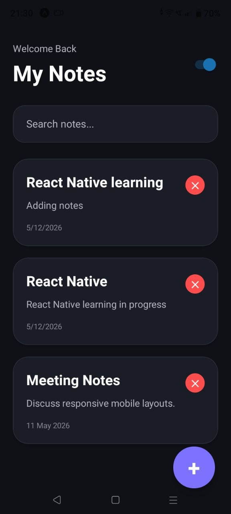
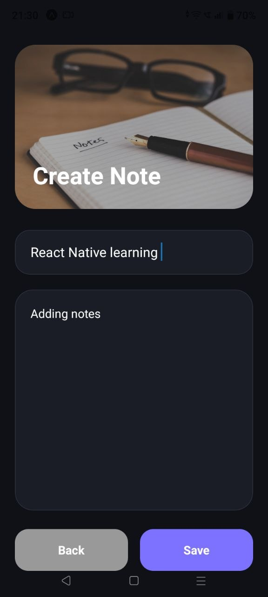
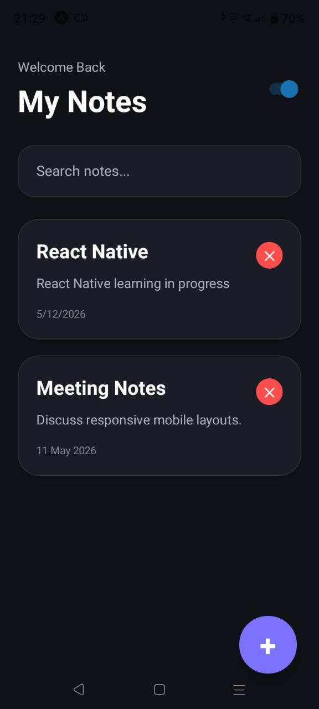
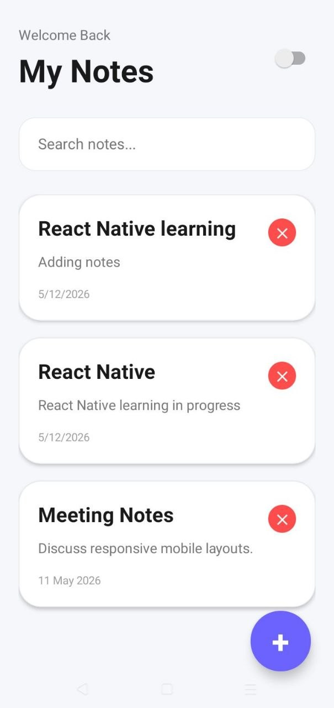

# 📝 Notes App UI – React Native & Expo

A modern and professional Notes Application built using **React Native**, **Expo SDK 55**, and **Expo Router**.

This project focuses on creating a polished mobile UI with:

- Dark & Light Theme
- Dynamic Note Creation
- Edit & Delete Features
- Responsive Mobile Layout
- Professional Component Structure
- Real-time State Management

---

# 📱 App Screens

## 🏠 Notes Listing Screen

Features included:

- FlatList for rendering notes
- Search functionality
- Dark/Light mode toggle
- Floating Action Button
- Edit existing notes
- Delete notes dynamically

---

## ✍️ Note Editor Screen

Features included:

- Create new notes
- Edit existing notes
- Save notes dynamically
- KeyboardAvoidingView support
- Responsive input layout
- Image background header

---

# ✨ Features

- 🌙 Dark / Light Theme Toggle
- 📝 Create Notes
- ✏️ Edit Notes
- ❌ Delete Notes
- 🔍 Search Notes
- 📱 Responsive Mobile Design
- ⚡ Real-time Theme Switching
- 🎨 Modern Professional UI
- 🧠 Context API State Management
- 📂 Proper Project Structure
- 📋 FlatList Rendering
- 📷 ImageBackground Header
- ⌨️ Keyboard Avoidance Support

---

# 🛠️ Technologies Used

- React Native
- Expo SDK 55
- Expo Router
- JavaScript
- React Context API

---

# 📂 Project Structure

```bash
notes-app/
│
├── app/
│   ├── _layout.tsx
│   ├── index.tsx
│   └── editor.tsx
│
├── components/
│   ├── ThemeContext.jsx
│   ├── NotesContext.jsx
│   └── NoteCard.jsx
│
├── screens/
│   └── NotesScreen.jsx
│
├── assets/
│
├── package.json
└── README.md
```

---

# 🚀 Installation & Setup

## 1️⃣ Clone Repository

```bash
git clone https://github.com/SUSHRUTO/Notes-App-Screen-UI
```

---

## 2️⃣ Navigate to Project Folder

```bash
cd notes-app
```

---

## 3️⃣ Install Dependencies

```bash
npm install
```

---

## 4️⃣ Start Expo Development Server

```bash
npx expo start
```

---

## 5️⃣ Run App on Mobile

- Install **Expo Go**
- Connect laptop and mobile to same WiFi
- Scan QR code from terminal/browser
- App opens automatically

---

# 📌 React Native Components Used

- View
- Text
- FlatList
- TextInput
- Pressable
- Switch
- KeyboardAvoidingView
- ImageBackground
- Alert

---

# ⚛️ React Hooks Used

- useState()
- useContext()
- useWindowDimensions()

---

# 🎯 Assignment Requirements Covered

✅ FlatList  
✅ Pressable  
✅ TextInput  
✅ Switch  
✅ KeyboardAvoidingView  
✅ ImageBackground  
✅ useWindowDimensions()  
✅ StyleSheet.create()  
✅ Responsive Layout  
✅ Dark/Light Theme  
✅ Two Separate Screens  
✅ Professional UI Structure

---

# 🎨 Additional Improvements Added

- Dynamic Note Saving
- Dynamic Note Editing
- Delete Note Functionality
- Floating Action Button
- Reusable Components
- Context API for State Management
- Responsive Tablet Support
- Professional UI Hierarchy

---

# 📸 Screenshots

## 🌞 Light Mode

(Add Screenshot Here)

---

## 🌙 Dark Mode






---

## ✍️ Editor Screen



---

# 📹 Demo Video

https://x.com/Sushruto2613/status/2054229751406137850?s=20

---

# 👨‍💻 Author

**Sushruto Majumdar**

---

# 📄 License

This project is developed for educational and assignment purposes only.